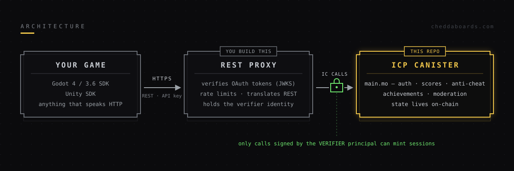
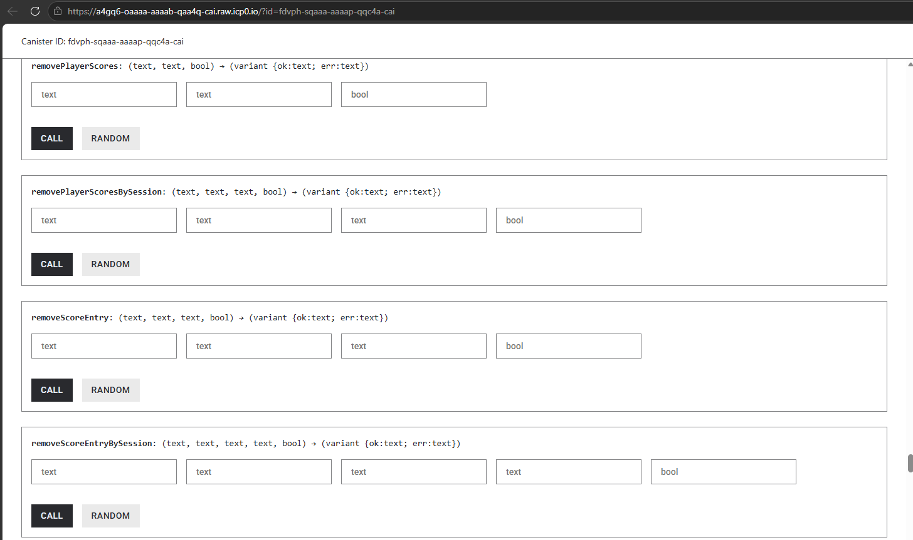

<p align="center">
  
</p>

**The open-source backend behind [cheddaboards.com](https://cheddaboards.com). Use the hosted service, or run your own.**

Permanent, serverless leaderboards, achievements, and player profiles — powered by the Internet Computer.

[](https://cheddaboards.com)
[](LICENSE)

---

## What's in this repo?

This is the **backend canister** for CheddaBoards — the on-chain logic that powers everything:

| Component | Description |
|-----------|-------------|
| `src/main.mo` | Motoko canister — game logic, leaderboards, auth, achievements, anti-cheat, moderation |
| `src/cheddaboards.did` | Candid interface — the full API contract |

The canister runs on the Internet Computer and stores all data permanently on-chain. No database, no server, no infrastructure to manage.

**Looking for SDKs?**
- [CheddaBoards-Godot](https://github.com/cheddatech/CheddaBoards-Godot) — Godot 4 **and** Godot 3.6 SDK (also on the [Godot Asset Store](https://store.godotengine.org/asset/cheddatech/cheddaboards))
- [CheddaBoards-Unity](https://github.com/cheddatech/CheddaBoards-Unity) — Unity C# SDK

All SDKs talk to the same REST API, so anything that can make HTTP requests works too — Unreal, GameMaker, native mobile, web, or your own engine.

---

## Architecture




The canister handles authentication, score validation, leaderboard management, achievements, moderation, and player profiles. Games communicate over plain HTTP with a thin REST proxy, which verifies OAuth tokens and translates requests into canister calls using its signing identity. The canister only accepts privileged auth calls from that identity (the **verifier**).

The hosted proxy at cheddaboards.com is not part of this repo — self-hosters build their own against the Candid interface (see below).

---

## Features

- **Multi-Auth**: Google, Apple, Internet Identity, Anonymous, Device Code (RFC 8628)
- **Leaderboards**: Real-time, server-validated scores
- **Timed Scoreboards**: Daily / weekly / monthly / custom-interval boards with automatic archiving
- **Category Scoreboards**: Targeted per-level, per-mode, or per-category boards — submit to one specific board by ID, without registering a separate game for each
- **Achievements**: Unlock tracking with timestamps
- **Moderation**: Game owners can delete individual score entries or wipe a player from their boards, with a hashed, capped audit log of every action
- **Anti-Cheat**: Rate limiting, score caps, play session time validation, shadowbans
- **Cross-Game Profiles**: Players keep one identity across all CheddaBoards games
- **Per-Game OAuth**: Developers register their own Google/Apple credentials
- **Account Migration**: Upgrade anonymous accounts to verified without losing data — scores and streaks merge by maximum, achievements are deduplicated

---

## Self-Hosting

Want to run your own instance? The canister is fully open-source.

### Prerequisites

- [dfx](https://internetcomputer.org/docs/current/developer-docs/setup/install/) (IC SDK)
- Basic familiarity with Motoko and the Internet Computer

### 1. Clone & Install

```bash
git clone https://github.com/cheddatech/cheddaboards.git
cd cheddaboards
```

### 2. Configure Principals

Open `src/main.mo` and replace the placeholder principals (`aaaaa-aa`) with your own:

```motoko
// Your proxy's signing identity — the only principal allowed to call
// the privileged auth methods. REPLACE with your own.
private transient let VERIFIER_PRINCIPAL : Text = "aaaaa-aa";

// Super admin (your dfx identity) — REPLACE with your own
private var CONTROLLER : Principal = Principal.fromText("aaaaa-aa");

// Bootstrap admin in postupgrade() (can be the same as controller) — REPLACE
let firstAdmin = Principal.fromText("aaaaa-aa");
```

Get your principal with: `dfx identity get-principal`

> ⚠️ **Set these before your first deploy.** The actor is `persistent`, so
> top-level variables are stable and survive upgrades — editing a literal
> after the fact won't change the running value. `VERIFIER_PRINCIPAL` is
> re-applied in `postupgrade()` so it can be rotated by upgrading; `CONTROLLER`
> is not, so get it right the first time.

### 3. Deploy

```bash
# Local testing
dfx start --background
dfx deploy

# Production (mainnet)
dfx deploy --network ic
```

### 4. Generate Candid Interface

```bash
dfx generate cheddaboards
```

You'll need to build your own API layer to translate REST/HTTP requests into canister calls. It must verify OAuth tokens itself (e.g. via JWKS) and call the canister with the signing identity you set as `VERIFIER_PRINCIPAL` — the canister rejects privileged auth calls from anyone else. The Candid interface defines all available methods and their signatures.

---

## Using the Hosted Version

Don't want to self-host? Use our hosted infrastructure at [cheddaboards.com](https://cheddaboards.com). Add the SDK as an autoload, then:

```gdscript
# Godot — 3-minute setup
CheddaBoards.set_api_key("your-api-key")
CheddaBoards.set_game_id("your-game-id")
CheddaBoards.login_anonymous("PlayerName")
```

**Free tier**: 3 games, unlimited players.

See the [documentation](https://github.com/cheddatech/CheddaBoards-Godot/tree/main/docs) for setup guides and API reference. (It's hosted in the Godot SDK repo for now, and will move to the site.)

---

## API Reference

The Candid interface (`cheddaboards.did`) defines the full canister API. Every deployed canister gets the Candid UI for free — here it is against the live production canister:



Key methods:

**Authentication**: `socialLoginAndGetProfile`, `anonymousLoginAndGetProfile`, `createSessionForVerifiedUser`, `validateSession`, `destroySession`

**Scores & Leaderboards**: `submitScore`, `submitScoreToBoard`, `getScoreboard`, `getLeaderboard`, `getPlayerRank`, `getPlayerScoreboardRank`

**Scoreboard Management**: `createScoreboard`, `updateScoreboard`, `resetScoreboard`, `deleteScoreboard` (principal-based), plus `createScoreboardBySession` / `resetScoreboardBySession` for session auth

**Moderation**: `getScoreboardAdmin`, `removeScoreEntry`, `removePlayerScores`, `getEntryDeletionLog` (each in session and principal variants)

**Archives**: `getScoreboardArchives`, `getLastArchivedScoreboard`

**Achievements**: `unlockAchievement`, `getAchievements`

**Play Sessions**: `startGameSessionByApiKey`, `startGameSessionBySession`, `getPlaySessionStatus`

**Profiles**: `getMyProfileBySession`, `getUserProfile`, `changeNicknameAndGetProfile`

**Stats**: `getSubmissionStats`, `getSystemInfo`

> **Fan-out vs targeted:** `submitScore` fans a score out to every standard board on the game (all-time, weekly, daily…). `submitScoreToBoard` writes to one board only — used for the per-level / per-category boards above. A board opts in to the targeted behaviour in its config.

---

## Contributing

Contributions welcome! This is open source because gaming infrastructure should be transparent and community-owned.

1. Fork the repo
2. Create a feature branch
3. Make your changes
4. Submit a PR

---

## Links

- **Website**: [cheddaboards.com](https://cheddaboards.com)
- **Docs**: [Godot SDK repo → /docs](https://github.com/cheddatech/CheddaBoards-Godot/tree/main/docs)
- **Changelog**: [CHANGELOG.md](CHANGELOG.md)
- **Games**: [chedda.games](https://chedda.games)
- **Company**: [cheddatech.com](https://cheddatech.com)
- **X**: [@cheddatech](https://x.com/cheddatech)

---

## License

MIT — see [LICENSE](LICENSE)

---

**Built by [CheddaTech Ltd](https://cheddatech.com) on the Internet Computer.**
